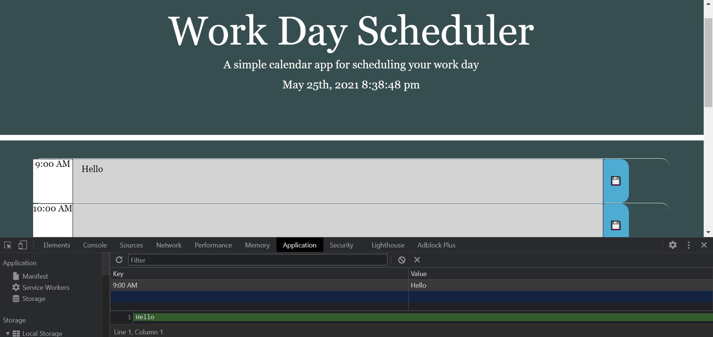

The Work Day Planner is desinged to oragnaize what you'll in the day. The time of day will change the background color of the time of day. You are able to write in the boxes and save it for later.

Used bootstrap and jQuery, local storage along with moment.js.

Type in the text area, then press the save button on the right and refresh the page. The text that was put in the text area should still be there because it was saveed to local storage.

Technologies used : HTML, CSS, JAvascript, Bootstrap, moment.js, jQuery.

